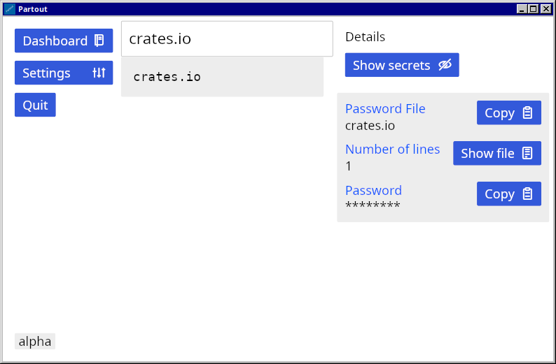

# Partout

[](https://crates.io/crates/partout)



## Introduction

A desktop app for [pass](https://www.passwordstore.org/), work in progress

I have also written a TUI for pass that is available in the [AUR](https://aur.archlinux.org/packages/passepartui) and in [nixpkgs](https://github.com/NixOS/nixpkgs):

[passepartui](https://github.com/kardwen/passepartui)

## Features

* Searching and filtering of passwords
* Support for viewing and copying of
  passwords and one-time passwords

## Installation

### Prerequisites

* Unix (tested on Linux so far)
* `pass`, optionally `pass-otp` for one-time passwords
* Rust and cargo

### Installation from crates.io

Partout can be found on [crates.io](https://crates.io/crates/partout).

```sh
cargo install partout --locked
```

Partout can be run by typing `partout` in a terminal emulator.

A desktop file is included in the `contrib` directory but needs
to be copied to `$XDG_DATA_HOME/applications`
(defaults to `~/.local/share/applications`) manually.

## Development

<a href="https://github.com/iced-rs/iced">
  
</a>

Library for pass: [`passepartout`](https://github.com/kardwen/passepartout)

```sh
cargo fmt
cargo clippy
```

Fonts:

[Jam icons](https://github.com/michaelampr/jam)
